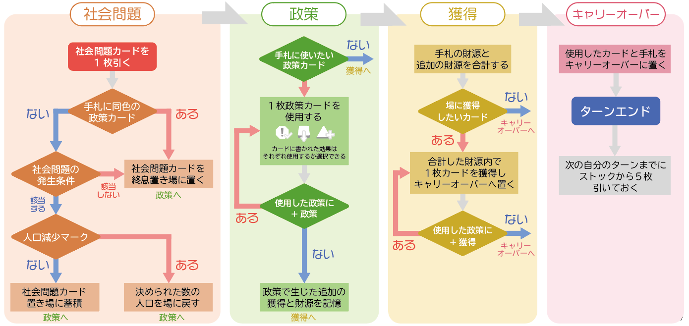
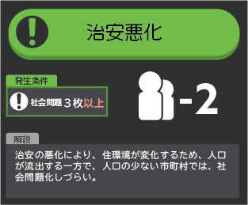

# ゲームの流れ

限界都市には、4つのフェーズがあります。

## 社会問題

### 社会問題カードを1枚引く
まず、**場** から社会問題カードを1枚引きます。

カードには、上部に蓄積するかどうかを示すマークと、中央にカードの効果が示されています。また、一部のカードには発生条件が示されていることがあります。

[画像]

まず、引いた時点で自分の手札に、社会問題カードの上部の色と同じ色の政策カードがあるかどうか確認します。手札にあった場合は、その社会問題カードを場の**終息置き場**に置きます。手札に同色の政策カードが無い場合は次へ進みます。

[画像]

次に社会問題の発生条件が、自分の今の状態に該当しない場合は、その社会問題カードを終息置き場に置きます。該当する場合、もしくは発生条件が示されていない場合は次に進みます。

[画像]

手札に同色の政策カードが無く、社会問題の発生条件に該当する、もしくは発生条件が示されていない場合、カード中央に示された効果が発動します。人口マークがある場合は、指定された数を場に戻します。幸福点のマークがある場合は、自分のプレイシートの**社会問題の蓄積**に置きます。ゲーム終了時まで蓄積し続けた場合、カードに示された数が減点されます。

## 政策
## 獲得
## キャリーオーバー